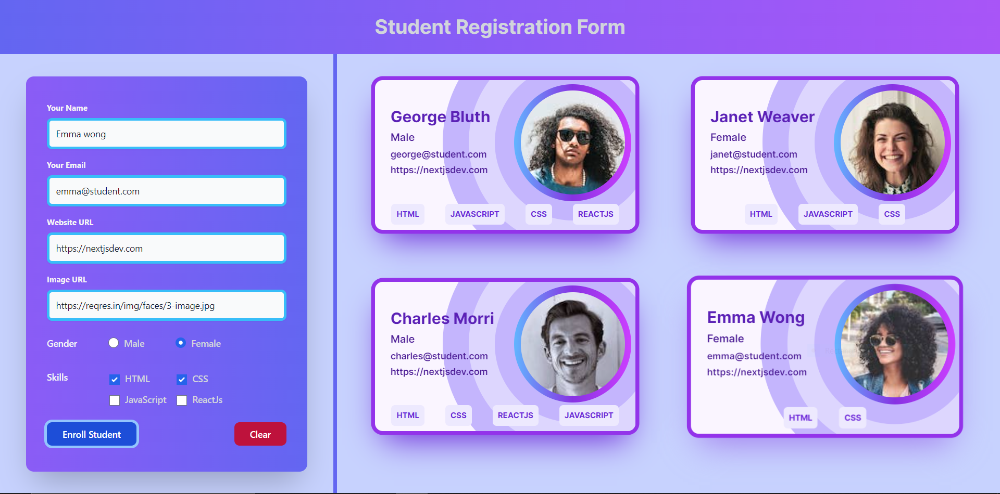

# LGMVIP-Web Virtual Internship Program — (1st Nov 2022 - 30th Nov 2022 )
  
  

### Project Task-3

** To Build a Student Registration Form App using React.js and any  CSS Framework (I chose ** Tailwind CSS **) as a part of my virtual internship provided by @LetsGrowMore as a Web Developer Intern. **

```bash

Task3:  Student Registration Form
IDE: Visual Studio Code

```

[Live Demo URL]()




### Project Overview

It consits of following Components:

* Header
* RegistrationForm
* StudentCard

### Tech Stack Used

- HTML5
- Tailwind CSS
- JavaScript
- React.js (Front-End UI Library)
- Vercel (For Hosting the App)

### UI Resources Used

* SVG Icons - (Hero Icons by Tailwind CSS)
* Fonts (Space Mono)- (Google fonts)

### The Code

Steps to run the app locally:


#### Step-1: Git Clone the project

```bash
   git clone https://github.com/raiv200/Registration-Form.git
```

#### Step-2: Install the dependencies

```bash
  npm install
```


#### Step-3: Start the development server

Now open your project in your favorite IDE , (VsCode) and then start the development server.

```bash
   npm run start
```
